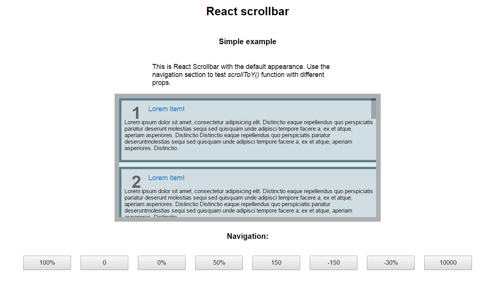
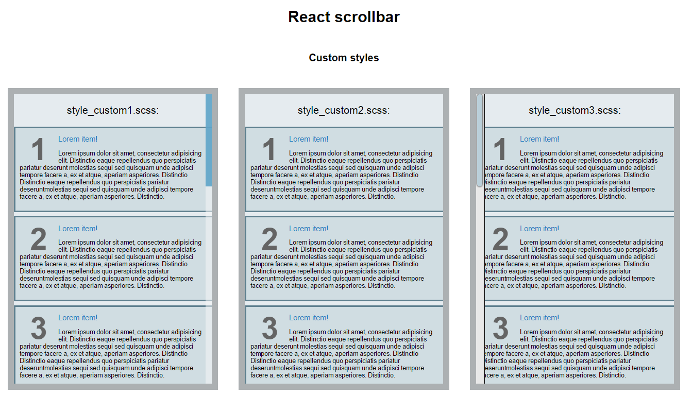

# React Scrollbar

The Simplest Scroll Area Component with custom scrollbar for [React Js](http://facebook.github.io/react/). It's adopted from [reactScrollbar](https://github.com/souhe/reactScrollbar) but without any dependencies. All animation, Height and Width are pure CSS, So it's TOTALLY **CUSTOMIZABLE** and **RESPONSIVE**! YEAH!.

[DEMO](https://bosnaufal.github.io/react-scrollbar)

## Install

You can install it via NPM
```bash
npm install react-scrollbar-js --save
```

> **Note**: You don't need any other dependencies or webpack loaders to start using this package. You can even use it with the `ES5` sintax if you need. But all examples in this readme will be shown in the `ES6` sintax.

## Usage

```javascript
// scrollable-component.jsx:
import React from 'react';
import ReactDOM from 'react-dom';

import ReactScrollbar from 'react-scrollbar-js';

class ScrollableComponent extends React.Component {

  render() {
    const myScrollbar = {
      width: 400,
      height: 400,
    };
    return(
      <ReactScrollbar style={myScrollbar}>
        <div className="should-have-a-children scroll-me">
          <p>And Now</p>
          <p>You Can Put</p>
          <p>A Long Content Here</p>
        </div>
      </ReactScrollbar>
    )
  }

}

```

> **Note**: `react-scrollbar-js` ships with a good looking default appearance, so you don't need to add any css styles to start it working. Only you need is to pass dimensions via [css](#classname-string-optional) or [inline style](#style-object-optional). But you can simply [customize](#scrollbar-structure) it by importing your own css styles.

## Props
##### className (String) [optional]

Just the ordinary class name of the root scrollbar element (`div`). So, It's TOTALLY **CUSTOMIZABLE!**

> default value: `'react-scrollbar-default'`

You can set different class names in oder to have some scrollbars with a various appearance on same page.

```css
/*The Scrollbar Root*/
.react-scrollbar-default {
  width: 35%;
  min-width: 300px;
  max-height: 450px;
}

/*The Content*/
.scroll-me {
  min-width: 750px;
}
```

##### style (Object) [optional]

If you prefer to use inline style to styling the scrollbar root (`div` element), you can pass the styling object to this props.

> default value: `{ }`

```javascript
let styling = {

  /* Scrollbar */
  scrollbar: {
    width: "35%",
    minWidth: "300px",
    maxHeight: "450px"
  },

}

<ReactScrollbar style={ styling.scrollbar } />
```

##### speed (Number) [optional]
The wheel step in pixel.

> default value: `53`

## API
##### scrollToY(y), scrollToX(x)

To scroll the scrollbar by vertical/horizontal

where `x` and `y` could be:

- numbers - sets scrollbar position in pixels
- strings like '58%' - sets scrollbar position in percents

if the value is negative it'll count from the end in the backward direction. ex: 

- `scrollToY(150)` set vertical scroll to 150px from top
- `scrollToY(-150)` set vertical scroll to 150px from bottom
- `scrollToY('30%')` set vertical scroll to 30% from top
- `scrollToY('-30%')` same as `scrollToY('70%')`

if you pass the value that is bigger than the maximum size it will scroll to 100%.

```javascript
// in ScrollableComponent class:
scrollTo(pos) {
  return () => {
    this.scroll.scrollToY(pos);
// or:    this.scroll.scrollToX(pos);
  };
}

// in ScrollableComponent render():
...
<ReactScrollbar ref={(c) => { this.scroll = c; }}>
...
```


## Customizing the appearance

You can add you own css styles to define the appearence and behavior of scrollbar. Scrollbar has a structure of nested elements wich defined by specific css classes. You need to follow this structure to apply your properties to the right place. Each element has a set of classes (the number is different depending on the current mode). In general it has name like: `-reactjs-scrollbar-element:modifier1:modifier2`. Modifiers are optional and specify a position or a interaction mode of element. For your convenience the elements has a range of classes with different combinations of modifiers, ex:

```javascript
-reactjs-scrollbar-track // for any scrollbar track in any state
-reactjs-scrollbar-track:vertical // for the vertical scrollbar track in any state
-reactjs-scrollbar-track:dragging // for any scrollbar track while dragging
-reactjs-scrollbar-track:vertical:dragging // for vertical scrollbar track while dragging
-reactjs-scrollbar-track:vertical:dragging:hover // ...and while mouse is over it

```

But oder of modifiers does matter, so you **can't** set `-reactjs-scrollbar-track:dragging:vertical`

*This class structure is inspired by [-webkit-scrollbar](https://css-tricks.com/custom-scrollbars-in-webkit/), but here it's pretty simplified*

##### Scrollbar structure

```javascript
react-scrollbar-default // The scrollbar root. You can set any className here
    
    -reactjs-scrollbar-area // Scrollbar children and tracks are here
    -reactjs-scrollbar-area:dragging // when it's dragging by mouse
    -reactjs-scrollbar-area:scrolling // when it's scrolling by mouse wheel
    
        scroll-content // it just a child element, you can set any className
        
        -reactjs-scrollbar-track // vertical track
        -reactjs-scrollbar-track:vertical:dragging // you can use one of them or bouth
        
            -reactjs-scrollbar-thumb // thumb on vertical track
            -reactjs-scrollbar-thumb:vertical:dragging // you can use one of them or bouth
            
        -reactjs-scrollbar-track // horizontal track
        -reactjs-scrollbar-track:horizontal:dragging // you can use one of them or bouth
        
            -reactjs-scrollbar-thumb // thumb on horizontal track
            -reactjs-scrollbar-thumb:horizontal:dragging // you can use one of them or bouth

```

> You can add `:hover` or any pseudo class you need. 

##### Style Applying

In oder to set custom style for your scrollbar add css styles to your page.

```js
// scrollable-component.jsx:
import './style_custom1.css';

// ScrollableComponent class:
...
<ReactScrollbar />
...
```

```css
// style_custom1.css:
.react-scrollbar-default .-reactjs-scrollbar-thumb {
  background: red;
  cursor: default;
  width: 10px;
  height: 10px; 
}
```

You can have some scrollbars with a different appearance. You can scope it by setting different root class names for them.

You can use the default style as a starting point for customizing:

[style_default.css](doc/examples/style_default.css)

[style_default.scss](doc/examples/style_default.scss)


## Examples

This repo has some example projects.

```shell
git clone https://github.com/BosNaufal/react-scrollbar.git
cd react-scrollbar-js/doc/examples/simple
# or 
cd react-scrollbar-js/doc/examples/custom

npm i
npm start
```

open [localhost:8080](http://localhost:8080/) in your browser.

<details>
  <summary>
    Simple example whit navigation API
  </summary>
  
  It has scrollbar with default settings and some navigation buttons
  
  
  
</details>

<details>
  <summary>
    Example of customizing scrollbars
  </summary>
  
  It has scrollbars with different css styles.
  
  
  
</details>


## Contributing

Start from cloning this repo:

```shell
git clone https://github.com/BosNaufal/react-scrollbar.git
cd react-scrollbar-js
npm i
npm start
```

open [localhost:8080](http://localhost:8080/) in your browser.

You will see a demo app with a scrollbar area.
All source code of this package is located in `src/` folder and the demo app is in `develop/` (it's not included into this package).

We use `webpack-dev-server` for developing. It starts by `npm start`. The config file is `webpack.dev.config.js`.

We publish to NPM a compiled and bundled code, so it could be used in ES5 projects and don't have any dependencies. To prepare a library bundle we use `webpack` with the `webpack.publish.config.js` config file.

To publish it to NPM save all src files and type:
```
npm publish
```

this script automatically prepare dist folder for publishing and if there are no errors publish it to NPM.

You can check this process without publishing by typing:
```
npm run prepublish
```

it'll do the follow:

- checks src code with ESLint (`npm run lint`)

- builds the library package into `dist/` folder (`npm run build`)

- puts an actual copy of default style into `doc/examples` (`npm run getstyles`) *you need to push it to GitHub manually after that*

We use ESLint for code linting in this project. You can try to fix some common linting issues by typing `npm run lintfix`. It'll check the code only within `src/` folder.

We are welcome any issues or PR's to make this project better!

## Thank You for Making this useful~

## Let's talk about some projects with me
Just Contact Me At:
- Email: [bosnaufalemail@gmail.com](mailto:bosnaufalemail@gmail.com)
- Skype Id: bosnaufal254
- twitter: [@BosNaufal](https://twitter.com/BosNaufal)

## License
[MIT](http://opensource.org/licenses/MIT)
Copyright (c) 2016 - forever Naufal Rabbani
